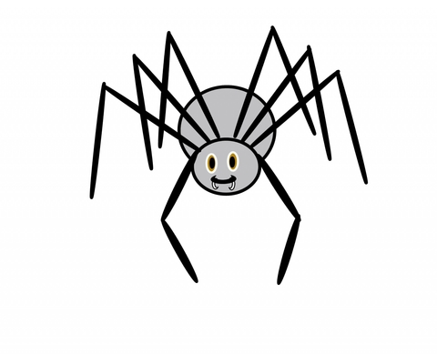

# Image Crawler

After having worked on a crawling script at work, I decided to try out creating a Symfony
4 application that fetches images from an url that you put in, just for fun and
to experiment with this Symfony version.

Obviously I couldn't help but add some Docker configuration as well. This application
has an Nginx container running as a reverse proxy in front of a php-fpm container.
The Nginx handles https offloading with self-signed certificates (in development) and
serves static files plus caches html pages. There's also a passwordless Redis database
container that handles caching and sessions.

This is by no means a stable or serious project.

## Prerequisites

In order to run this application in an isolated environment and to make installing it
easier, all you need is Docker. It's also advisable to have Make installed to
make use of the makefile.

## Getting started

Setting up the application is as easy as:
1. `git clone` the application and navigate to the project's directory
2. Run `make up` to start the application in development mode
3. Run `make composer.install` to install the dependencies in the php containers
4. Go to [localhost](https://localhost) to start crawling

## Possible plans for the future

- ~~Perhaps put the browser in a different container~~
- ~~Ensure chromium does not crash in the background (or perhaps switch to simpler crawler)~~
- ~~Add the ability to save images~~
- Allow mixed content (http/https)
- Add more security
- Remove empty images from results
- Add password to Redis
- Add phpstan
- Add tests
- Add php-cs-fixer
- Add in some error pages for better exception handling

## Known quirks

- Https/http mixing goes wrong

## Notes

- Spider image source: _https://www.publicdomainpictures.net/nl/view-image.php?image=55905&picture=clip-art-spider_
